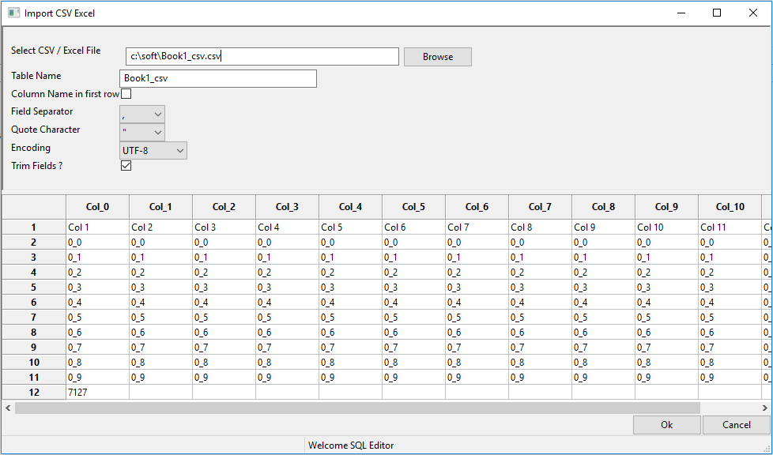

# SQL editor

[](./LICENSE)
[](https://www.paypal.com/cgi-bin/webscr?cmd=_s-xclick&hosted_button_id=EUWCHQJXB9Y2N)
[](https://travis-ci.com/struts2spring/sql-editor)
[](https://github.com/struts2spring/sql-editor)
[](https://badge.fury.io/py/sql-editor)
----------------------------------------------

     
SQL editor is free, open source,  Integrated Development Environment(IDE) for working with SQL in SQLite databases. 


## Support the project

To support this project you can: star the repository, report bugs/request features by creating new issues, write code and create PRs or donate.

[](https://www.paypal.com/cgi-bin/webscr?cmd=_s-xclick&hosted_button_id=EUWCHQJXB9Y2N)

## Install SQL editor

Install the Sql editor from source code.

```shell
$ cd sql_editor
$ python setup.py install

sql_editor
```

or 

Install the Sql editor using pip command.

```
$ pip install sql_editor
```


### Features

1. Currently supports only python 3 build.
2. Support only sqlite database.
3. Graphical user interface for sqlite 3.





### Repository

[](https://github.com/struts2spring/sql-editor)

=======
# sql-editor

