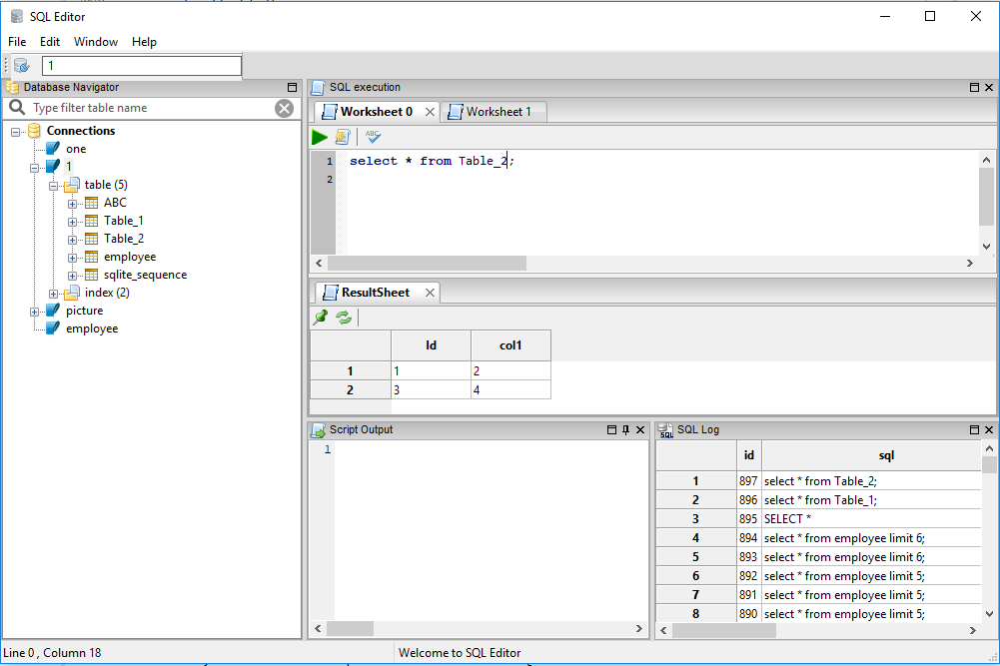
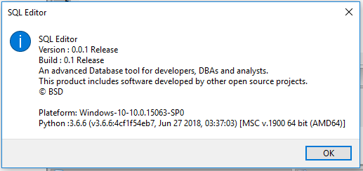
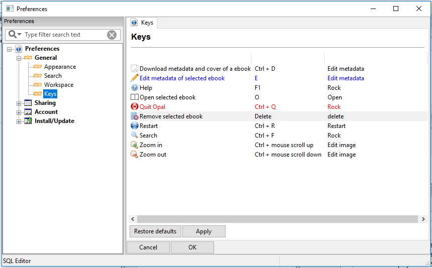

# SQL editor

[](./LICENSE)
[](https://www.paypal.com/cgi-bin/webscr?cmd=_s-xclick&hosted_button_id=EUWCHQJXB9Y2N)
----------------------------------------------


SQL editor can be build using python 3 only. 



## Support the project

To support this project you can: star the repository, report bugs/request features by creating new issues, write code and create PRs or donate.

[](https://www.paypal.com/cgi-bin/webscr?cmd=_s-xclick&hosted_button_id=EUWCHQJXB9Y2N)

## Building SQL editor


```shell
cd sql_editor
python setup.py install

sql_editor
```




### Features

1. Currently supports only python 3 build.
2. Support only sqlite database.
3. Graphical user interface for sqlite 3.





### Repository

[](https://github.com/struts2spring/sql-editor)
[](https://gitlab.com/struts2spring/sql-editor)

=======
# sql-editor

